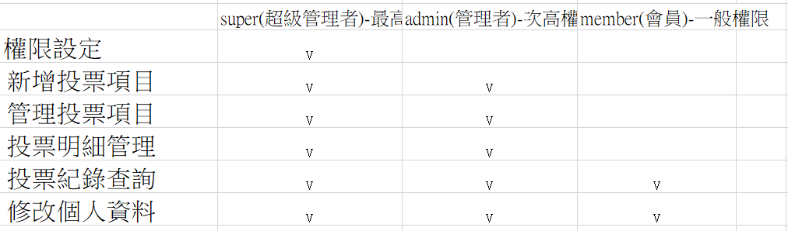

# 111年度資料庫程式設計作業

## 前後台整合系統
### 主題-投票
1. 

### 動作要求(以投票功能為例)
1. 分析需要的功能
    * 功能一 — 前台
    (1).投票主題的列表讓使用者可以選擇
    (2).投票結果以圖表顯示
    (3).同一主題禁止重複投票
    (4).投票資格限制-會員及非會員
    
    * 功能二 — 後台
    (1).新增與修改投票主題及項目
    (2).設計3種等級，登入者依權限不同，可執行不同功能
    super(超級管理者)-最高權限-
    admin(管理者)-次高權限-
    member(會員)-一般權限
    
    

    * 功能三 — 改進
    (01).複選題限制投票票數
    (02).排版
    (03).增加互動動畫
    (04).限定會員才可觀看限定結果
    (05).上傳圖片限制檔案大小
    (06).選項新增圖片
    (07).編輯主題新增資格限定
    (08).修改個資判斷資料吻合
    (09).關鍵字搜尋
    (10).投票倒數計時
    (11).做RWD版 
  

2. 設計資料表
    * 資料表一(logs)
       
    * 資料表二(members)
        
    * 資料表三(options)
           
    * 資料表四(topics)
        

4. 請上傳至220的伺服器個人空間，並自行建立所需資料表
   
5. 請將完成品前後台及功能截圖五張放在ScreenShot資料夾下

